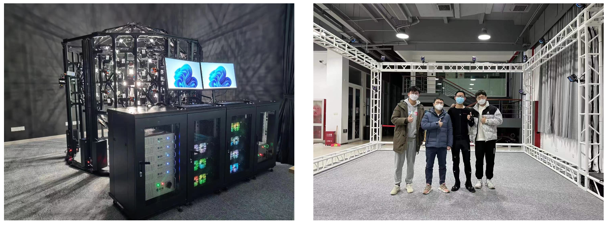

## Yichao Yan 

## Associate Professor, AI Institute, Shanghai Jiao Tong University

[Google Scholar](https://scholar.google.com/citations?user=ZPHMMRkAAAAJ&hl=zh-CN)  [Github](https://github.com/daodaofr)

Email: yanyichao(at)sjtu.edu.cn

Office: 5-510, Software building, Shanghai Jiao Tong University.

### Facilities
We have a light stage and a motion/volume capture device. We have abundant GPUs.

### Opening Positions
**We are looking for post-doc researchers, collaborating with Professor Xiaokang Yang!**  
I am a co-chair of the SJTU [[AIGC Class]](https://sjtu-aigc.github.io/).
Looking for self-motivated undergraduate and graduate students to work with me in computer vision, AIGC, and 3D modeling. For prospective students, please send your resume and transcript to my email. 

### Biography

I am a tenure-track associate professor at [Shanghai Jiao Tong University](http://www.sjtu.edu.cn). I received my PhD degree from Shanghai Jiao Tong University in 2019, supervised by Professor [Xiaokang Yang](https://scholar.google.com/citations?user=yDEavdMAAAAJ&hl=en). I received M. E. from [École Centrale de Lyon](https://www.ec-lyon.fr/) in France. I received B. E. from Shanghai Jiao Tong University in 2013. I was a research scientist at the [Inception Institute of Artificial Intelligence (IIAI)](https://www.inceptioniai.org/) from June 2019 to April 2021.

I am interested in **computer vision** problems. Typically, I am working on (1) 3D representation (2) AIGC (3) Embodied AI. 

### Updates   
- 02/2025, Two papers on 3D face reconstruction are accepted by **CVPR** 2025.
- 01/2025, Two papers on 3D reconstruction and image editing are accepted by **ICLR** 2025.
- 12/2024, “关系驱动的视觉目标解析理论与方法”获得中国图象图形学学会自然科学二等奖（排2）.
- 11/2024, One paper on efficient 3D reconstruction is accepted by **TVCG**.
- 10/2023, 团队获得中国国际大学生创新大赛（2024）上海赛区 **2 项金奖**.
- 09/2024, One paper on inverse rendering is accepted by **NeurIPS** 2024.
- 09/2024, One paper on video anomaly detection is accepted by **TCSVT**.
- 07/2024, Three papers on avatar generation, face animation, and diffusion model are accepted by **ACM Multimedia** 2024.
- 07/2024, Two papers on 4D face reconstruction and human-object interaction are accepted by **ECCV** 2024.
- 02/2024, Four papers on human interaction generation, face reconstruction and editing are accepted by **CVPR** 2024.
- 02/2024, One paper on human action recognition is accepted by **TPAMI**.
- 11/2023, 团队获得第十八届“挑战杯”数字人专项赛**特等奖**.
- 09/2023, We will organize a workshop "[AI for Digital Human](https://digitalhumanworkshop.github.io/)" on **AAAI** 2024.
- 09/2023, One paper on NeRF-based visual localization is accepted by **NeurIPS** 2023.
- 07/2023, One paper on human action generation is accepted by **ICCV** 2023.
- 06/2023, We win the championship of the 2023 Ego4D Challenge in the Episodic memory: PACO Zero-Shot track.
- 03/2023, Three papers on 3D digital human generation/reconstruction are accepted by **CVPR** 2023.

### Preprints

* **Disentangled Clothed Avatar Generation with Layered Representation.**  
*Weitian Zhang, Sijing Wu, Manwen Liao, **Yichao Yan**  
arXiv Preprint, 2025.*  
[[project]](https://olivia23333.github.io/LayerAvatar/)

* **Multimodal Latent Diffusion Model for Complex Sewing Pattern Generation.**  
*Shengqi Liu, Yuhao Cheng, Zhuo Chen, Xingyu Ren, Wenhan Zhu, Lincheng Li, Mengxiao Bi, Xiaokang Yang, **Yichao Yan**  
arXiv Preprint, 2024.*  
[[project]](https://shengqiliu1.github.io/SewingLDM/)

* **SingingHead: A Large-scale 4D Dataset for Singing Head Animation.**  
*Sijing Wu, Yunhao Li, Weitian Zhang, Jun Jia, Yucheng Zhu, **Yichao Yan**, Guangtao Zhai, Xiaokang Yang  
arXiv Preprint, 2023.*  
[[project]](https://wsj-sjtu.github.io/SingingHead/)

* **Rethinking Clothes Changing Person ReID: Conflicts, Synthesis, and Optimization.**  
*Junjie Li, Guanshuo Wang, Fufu Yu, **Yichao Yan**, Qiong Jia, Shouhong Ding, Xingdong Sheng, Yunhui Liu, Xiaokang Yang  
arXiv Preprint, 2024.*  
[[paper]](https://arxiv.org/abs/2404.12611)

### Publications

* **Revealing Directions for Text-guided 3D Face Editing.**  
*Zhuo Chen, **Yichao Yan**, Sehngqi Liu, Yuhao Cheng, Weiming Zhao, Lincheng Li, Mengxiao Bi, Xiaokang Yang  
IEEE Transactions on Multimedia (**TMM**), 2025.*  
[[paper]](https://arxiv.org/abs/2410.04965)

* **PostEdit: Posterior Sampling for Efficient Zero-Shot Image Editing.**  
*Feng Tian, Yixuan Li, **Yichao Yan**, Shanyan Guan, Yanhao Ge, Xiaokang Yang  
International Conference on Learning Representations (**ICLR**), 2025.*  
[[paper]](https://arxiv.org/abs/2410.04844)

* **AniSDF: Fused-Granularity Neural Surfaces with Anisotropic Encoding for High-Fidelity 3D Reconstruction.**  
*Jingnan Gao, Zhuo Chen, **Yichao Yan**, Xiaokang Yang  
International Conference on Learning Representations (**ICLR**), 2025.*  
[[project]](https://g-1nonly.github.io/AniSDF_Website/)

* **GPS: Generalizable Person Search on Open-world User-generated Video Content.**  
*Junjie Li, Guanshuo Wang, **Yichao Yan**, Fufu Yu, Qiong Jia, Jie Qin, Shouhong Ding, Xiaokang Yang  
IEEE Transactions on Circuits and Systems for Video Technology (**TCSVT**), 2025.*  
[[paper]](https://ieeexplore.ieee.org/abstract/document/10839440/)

* **EvaSurf: Efficient View-Aware Implicit Textured Surface Reconstruction on Mobile Devices.**  
*Jingnan Gao, Zhuo Chen, **Yichao Yan**, Bowen Pan, Zhe Wang, Jiangjing Lyu, Xiaokang Yang  
IEEE Transactions on Visualization and Computer Graphics (**TVCG**), 2024*  
[[project]](https://g-1nonly.github.io/EvaSurf-Website/)

* **Multi-times Monte Carlo Rendering for Inter-reflection Reconstruction.**  
*Tengjie Zhu, Zhuo Chen, Jingnan Gao, **Yichao Yan**, Xiaokang Yang  
Conference on Neural Information Processing Systems (**NeurIPS**), 2024.*  
[[project]](https://zhutengjie.github.io/Ref-MC2/)

* **IPAD: Industrial Process Anomaly Detection Dataset.**  
*Jinfan Liu, **Yichao Yan**, Junjie Li, Weiming Zhao, Pengzhi Chu, Xingdong Sheng, Yunhui Liu, Xiaokang Yang  
IEEE Transactions on Circuits and Systems for Video Technology (**TCSVT**), 2024.*  
[[project]](https://ljf1113.github.io/IPAD_VAD/)

* **E^3Gen: Efficient, Expressive and Editable Avatars Generation.**  
*Weitian Zhang, **Yichao Yan**, Yunhui Liu, Xingdong Sheng, Xiaokang Yang.  
**ACM Multimedia**, 2024.*  
[[project]](https://olivia23333.github.io/E3Gen/)

* **Infusion: Preventing Customized Text-to-Image Diffusion from Overfitting.**  
*Weili Zeng, **Yichao Yan**, Qi Zhu, Zhuo Chen, Pengzhi Chu, Weiming Zhao, Xiaokang Yang.  
**ACM Multimedia**, 2024.*  
[[project]](https://zwl666666.github.io/infusion/)

* **MMHead: Towards Fine-grained Multi-modal 3D Facial Animation.**  
*Sijing Wu, Yunhao Li, **Yichao Yan**, Huiyu Duan, Ziwei Liu, Guangtao Zhai.  
**ACM Multimedia**, 2024.*   
[[project]](https://wsj-sjtu.github.io/MMHead/)

* **Topo4D: Topology-Preserving Gaussian Splatting for High-Fidelity 4D Head Capture.**  
*Xuanchen Li, Yuhao Cheng, Xingyu Ren, Haozhe Jia, Di Xu, Wenhan Zhu, **Yichao Yan**.  
European Conference on Computer Vision (**ECCV**), 2024.*  
[[project]](https://xuanchenli.github.io/Topo4D/)

* **HIMO: A New Benchmark for Full-Body Human Interacting with Multiple Objects.**  
*Xintao Lv, Liang Xu, **Yichao Yan**, Xin Jin, Congsheng Xu, Shuwen Wu, Yifan Liu, Lincheng Li, Mengxiao Bi, Wenjun Zeng, Xiaokang Yang.  
European Conference on Computer Vision (**ECCV**), 2024.*  
[[project]](https://lvxintao.github.io/himo/)

* **HyperStyle3D: Text-Guided 3D Portrait Stylization via Hypernetworks.**  
*Zhuo Chen, Xudong Xu, **Yichao Yan**, Ye Pan, Wenhan Zhu, Wayne Wu, Bo Dai, and Xiaokang Yang.  
IEEE Transactions on Circuits and Systems for Video Technology (**TCSVT**), 2024.*  
[[project]](https://windlikestone.github.io/HyperStyle3D-website/)

* **3D-Aware Face Editing via Warping-Guided Latent Direction Learning.**  
*Yuhao Cheng, Zhuo Chen, Xingyu Ren, Wenhan Zhu, Zhengqin Xu, Di Xu, Changpeng Yang, **Yichao Yan**.  
IEEE Conference on Computer Vision and Pattern Recognition (**CVPR**), 2024.*  
[[project]](https://cyh-sj.github.io/FaceEdit3D/)

* **Inter-X: Towards Versatile Human-Human Interaction Analysis.**  
*Liang Xu, Xintao Lv, **Yichao Yan**, Xin Jin, Shuwen Wu, Congsheng Xu, Yifan Liu, Yizhou Zhou, Fengyun Rao, Xingdong Sheng, Yunhui Liu, Wenjun Zeng, Xiaokang Yang.  
IEEE Conference on Computer Vision and Pattern Recognition (**CVPR**), 2024.*  
[[paper]](https://arxiv.org/pdf/2312.16051.pdf) [[project]](https://liangxuy.github.io/inter-x/)

* **ReGenNet: Towards Human Action-Reaction Synthesis.**  
*Liang Xu, Yizhou Zhou, **Yichao Yan**, Xin Jin, Wenhan Zhu, Fengyun Rao, Xiaokang Yang, Wenjun Zeng.  
IEEE Conference on Computer Vision and Pattern Recognition (**CVPR**), 2024.*  
[[paper]](https://arxiv.org/abs/2403.11882) [[project]](https://liangxuy.github.io/ReGenNet/)

* **Monocular Identity-Conditioned Facial Reflectance Reconstruction.**  
*Xingyu Ren, Jiankang Deng, Yuhao Cheng, Jia Guo, Chao Ma, **Yichao Yan**, Wenhan Zhu, Xiaokang Yang.  
IEEE Conference on Computer Vision and Pattern Recognition (**CVPR**), 2024.*  
[[project]](https://xingyuren.github.io/id2reflectance/)

* **A Coding Framework and Benchmark towards Low-Bitrate Video Understanding.**  
*Yuan Tian, Guo Lu, **Yichao Yan**, Guangtao Zhai, Li Chen, Zhiyong Gao.  
IEEE Transactions on Pattern Analysis and Machine Intelligence (**TPAMI**), 2024.*  
[[paper]](https://ieeexplore.ieee.org/abstract/document/10440520)

* **Head3D: Complete 3D Head Generation via Tri-plane Feature Distillation.**  
*Yuhao Cheng, **Yichao Yan**, Wenhan Zhu, Ye Pan, Bowen Pan, Xiaokang Yang.  
ACM Transactions on Multimedia Computing, Communications, and Applications (**TOMM**), 2024.*  
[[paper]](https://dl.acm.org/doi/10.1145/3635717)

* **NeRF-IBVS: Visual Servo Based on NeRF for Visual Localization and Navigation.**  
*Yuanze Wang, **Yichao Yan**, Dianxi Shi, Wenhan Zhu, Jianqiang Xia, Jianqiang Xia, Tan Jeff, Songchang Jin, Ke Gao, Xiaobo Li, Xiaokang Yang.  
Conference on Neural Information Processing Systems (**NeurIPS**), 2023.*  
[[paper]](https://openreview.net/forum?id=9pLaDXX8m3)

* **ActFormer: A GAN-based Transformer towards General Action-Conditioned 3D Human Motion Generation.**  
*Liang Xu, Ziyang Song, Dongliang Wang, Jing Su, Zhicheng Fang, Chenjing Ding, Weihao Gan, **Yichao Yan**, Xin Jin, Xiaokang Yang, Wenjun Zeng, Wei Wu.  
International Conference on Computer Vision (**ICCV**), 2023.*  
[[paper]](https://arxiv.org/abs/2203.07706) [[project]](https://liangxuy.github.io/actformer/)

* **A survey on generative 3D digital humans based on neural networks: representation, rendering and learning. (In Chinese)**  
基于神经网络的生成式三维数字人研究综述:表示、渲染与学习.  
***Yichao Yan**, Yuhao Cheng, Zhuo Chen, Yicong Peng, Sijing Wu, Weitian Zhang, Junjie Li, Yixuan Li, Jingnan Gao, Weixia Zhang, Guangtao Zhai, Xiaokang Yang.  
中国科学：信息科学，SCIENTIA SINICA Informationis, (2023)*  
[[paper]](https://www.sciengine.com/SSI/doi/10.1360/SSI-2022-0319;JSESSIONID=d57dd3fc-fb60-482c-b2d6-358d4c66cace)

* **行人再识别技术研究进展综述.**  
*张永飞,杨航远,张雨佳,豆朝鹏,廖胜才,郑伟诗,张史梁,叶茫,**晏轶超**,李俊杰,王生进.  
中国图象图形学报, 2023.*  
[[paper]](http://www.cjig.cn/jig/ch/reader/view_abstract.aspx?edit_id=20230227155118001&flag=2&file_no=202301130000003&journal_id=jig) 

* **Improving Fairness in Facial Albedo Estimation via Visual-Textual Cues.**  
*YXingyu Ren, Jiankang Deng, Chao Ma, **Yichao Yan**, Xiaokang Yang.  
Proceedings of the IEEE Conference on Computer Vision and Pattern Recognition (**CVPR**), 2023.*  
[[paper]](https://openaccess.thecvf.com/content/CVPR2023/html/Ren_Improving_Fairness_in_Facial_Albedo_Estimation_via_Visual-Textual_Cues_CVPR_2023_paper.html) [[project]](https://xingyuren.github.io/id2albedo/)  

* **3D-Aware Face Swapping.**  
*Yixuan Li, Chao Ma, **Yichao Yan**, Wenhan Zhu, Xiaokang Yang.  
Proceedings of the IEEE Conference on Computer Vision and Pattern Recognition (**CVPR**), 2023.*  
[[paper]](https://openaccess.thecvf.com/content/CVPR2023/html/Li_3D-Aware_Face_Swapping_CVPR_2023_paper.html) [[project]](https://lyx0208.github.io/3dSwap)  

* **GANHead: Towards Generative Animatable Neural Head Avatars.**  
*Sijing Wu, **Yichao Yan**, Yunhao Li, Yuhao Cheng, Wenhan Zhu, Ke Gao, XiaoBo Li, Guangtao Zhai.  
Proceedings of the IEEE Conference on Computer Vision and Pattern Recognition (**CVPR**), 2023.*  
[[paper]](https://arxiv.org/abs/2304.03950) [[project]](https://wsj-sjtu.github.io/GANHead/)  

* **StyleVR: Stylizing Character Animations with Normalizing Flows.**  
*Bin Ji, Ye Pan, **Yichao Yan**, Ruizhao Chen, Xiaokang Yang.  
IEEE Transactions on Visualization and Computer Graphics(**TVCG**), 2023.*  
[[paper]](https://ieeexplore.ieee.org/abstract/document/10076832) 

* **Efficient Person Search: An Anchor-Free Approach.**  
***Yichao Yan**, Jinpeng Li, Jie Qin, Shengcai Liao, Xiaokang Yang.  
International Journal of Computer Vision (**IJCV**), 2023.*  
[[paper]](https://link.springer.com/article/10.1007/s11263-023-01772-3) [[code]](https://github.com/daodaofr/AlignPS)  

* **CLSA: A Contrastive Learning Framework with Selective Aggregation for Video Rescaling.**  
*Yuan Tian, **Yichao Yan**, Guangtao Zhai, Li Chen, Zhiyong Gao.  
IEEE Transactions on Image Processing (**TIP**), 2023.*  
[[paper]](https://ieeexplore.ieee.org/document/10042234)  

* **CageNeRF: Cage-based Neural Radiance Field for Generalized 3D Deformation and Animation.**  
*Yicong Peng, **Yichao Yan**, Shengqi Liu, Yuhao Cheng, Shanyan Guan, Bowen Pan, Guangtao Zhai, Xiaokang Yang.  
Conference on Neural Information Processing Systems (**NeurIPS**), 2022.*   
[[paper]](https://openreview.net/forum?id=kUnHCGiILeU) [[project]](https://pengyicong.github.io/CageNeRF/)  

* **EAN: Event Adaptive Network for Enhanced Action Recognition.**  
*Yuan Tian,  **Yichao Yan**, Xiongkuo Min, Guo Lu, Guangtao Zhai, Guodong Guo, Zhiyong Gao.  
International Journal of Computer Vision (**IJCV**), 2022.*  
[[paper]](https://arxiv.org/abs/2107.10771) [[code]](https://github.com/tianyuan168326/EAN-Pytorch)  

* **Domain Adaptive Person Search.**  
*Junjie Li, **Yichao Yan**, Guanshuo Wang, Fufu Yu, Qiong Jia, Shouhong Ding.  
European Conference on Computer Vision (**ECCV Oral**), 2022.*   
[[paper](https://arxiv.org/pdf/2207.11898.pdf)]  [[code](https://github.com/caposerenity/DAPS)]  

* **Exploring Visual Context for Weakly Supervised Person Search.**  
***Yichao Yan**\*, Jinpeng Li\*, Shengcai Liao, Jie Qin, Bingbing Ni, Xiaokang Yang, Ling Shao.  
AAAI Conference on Artificial Intelligence (**AAAI**), 2022.*  
[[paper]](https://arxiv.org/abs/2106.10506) [[code]](https://github.com/ljpadam/CGPS)  

* **Anchor-Free Person Search.**  
***Yichao Yan**\*, Jinpeng Li\*, Jie Qin, Song Bai, Shengcai Liao, Li Liu, Fan Zhu, Ling Shao.  
Proceedings of the IEEE Conference on Computer Vision and Pattern Recognition (**CVPR**) 2021.*  
[[paper]](https://arxiv.org/abs/2103.11617) [[code]](https://github.com/daodaofr/AlignPS)  

* **Learning Multi-Attention Context Graph for Group-Based Re-Identification.**  
***Yichao Yan**\*, Jie Qin\*, Bingbing Ni, Jiaxin Chen, Li Liu, Fan Zhu, Wei-Shi Zheng, Xiaokang Yang, Ling Shao.  
IEEE Trans. on Pattern Analysis and Machine Intelligence (**TPAMI**) 2020.*  
[[paper]](https://arxiv.org/abs/2104.14236)  [[code]](https://github.com/daodaofr/group_reid)  

* **Learning Multi-Granular Hypergraphs for Video-Based Person Re-Identification.**   
***Yichao Yan**\*, Jie Qin\*, Jiaxin Chen, Li Liu, Fan Zhu, Ying Tai, Ling Shao.  
Proceedings of the IEEE Conference on Computer Vision and Pattern Recognition (**CVPR**) 2020.*  
[[paper]](https://openaccess.thecvf.com/content_CVPR_2020/papers/Yan_Learning_Multi-Granular_Hypergraphs_for_Video-Based_Person_Re-Identification_CVPR_2020_paper.pdf)  [[code]](https://github.com/daodaofr/hypergraph_reid) 

* **Learning Context Graph for Person Search.**  
***Yichao Yan**\*, Qiang Zhang\*, Bingbing Ni, Minghao Xu, and Xiaokang Yang.  
Proceedings of the IEEE Conference on Computer Vision and Pattern Recognition (**CVPR**) 2019, Oral.*  
[[paper]](https://arxiv.org/abs/1904.01830)  [[code]](https://github.com/sjtuzq/person_search_gcn)

* **Fine-grained Video Captioning via Graph-based Multi-granularity Interaction Learning.**  
***Yichao Yan**\*, Ning Zhuang\*, Bingbing Ni\*, Jian Zhang, Minghao Xu, Qiang Zhang, Zheng Zhang, Shuo Cheng, Qi Tian, Xiaokang Yang, Wenjun Zhang.  
IEEE Trans. on Pattern Analysis and Machine Intelligence (**TPAMI**) 2019.*  
[[paper]](https://ieeexplore.ieee.org/document/8865609)

* **Person Re-Identification via Recurrent Feature Aggregation.**  
***Yichao Yan**, Bingbing Ni, Zhichao Song, Chao Ma, Yan Yan and Xiaokang Yang.  
European Conference on Computer Vision (**ECCV**), 2016.*  
[[paper]](https://drive.google.com/open?id=0ByS8YXR7ycXHU1ZwSXNPWUNtNFU) [[code]](https://github.com/daodaofr/caffe-re-id) [[data&model]](https://drive.google.com/open?id=0ByS8YXR7ycXHMGtJSkRLQUVlcmM)

* **Cross-modality motion parameterization for fine-grained video prediction.**  
***Yichao Yan**, Bingbing Ni, Wendong Zhang, Jun Tang, Xiaokang Yang.  
Computer Vision and Image Understanding (**CVIU**) 2019.*  
[[paper]](https://www.sciencedirect.com/science/article/abs/pii/S1077314219300426) 

* **Structure-Constrained Motion Sequence Generation.**  
***Yichao Yan**, Bingbing Ni, Wendong Zhang, Jingwei Xu, Xiaokang Yang.  
IEEE Transactions on Multimedia (**TMM**) 2018.*  
[[paper]](https://ieeexplore.ieee.org/abstract/document/8565937)

* **Pose transferrable person re-identification.**  
*Jinxian Liu\*, Bingbing Ni\*, **Yichao Yan**\*, Peng Zhou, Shuo Cheng, Jianguo Hu.  
Proceedings of the IEEE Conference on Computer Vision and Pattern Recognition (**CVPR**) 2018.*  
[[paper]](http://openaccess.thecvf.com/content_cvpr_2018/html/Liu_Pose_Transferrable_Person_CVPR_2018_paper.html)

* **Multi-level attention model for person re-identification.**  
***Yichao Yan**, Bingbing Ni, Jinxian Liu, Xiaokang Yang.  
Pattern Recognition Letters (**PRL**)2018.*  
[[paper]](https://www.sciencedirect.com/science/article/abs/pii/S0167865518304562)

* **Video summarization via semantic attended networks.**  
*Huawei Wei, Bingbing Ni, **Yichao Yan**, Huanyu Yu, Xiaokang Yang, Chen Yao.  
Thirty-Second AAAI Conference on Artificial Intelligence  (**AAAI**) 2018.*  
[[paper]](https://www.aaai.org/ocs/index.php/AAAI/AAAI18/paper/view/16581/15690)

* **Skeleton-aided articulated motion generation.**  
***Yichao Yan**, Jingwei Xu, Bingbing Ni, Wendong Zhang and Xiaokang Yang.  
Proceedings of the 25th ACM international conference on Multimedia (**ACM MM**) 2017.*  
[[paper]](https://arxiv.org/abs/1707.01058)

* **Fine-grained recognition via attribute-guided attentive feature aggregation.**  
***Yichao Yan**, Bingbing Ni and Xiaokang Yang.  
Proceedings of the 25th ACM international conference on Multimedia (**ACM MM**) 2017.*  
[[paper]](https://dl.acm.org/citation.cfm?id=3123358)

* **Deep Cross-Modality Alignment for Multi-Shot Person Re-IDentification.**  
*Zhichao Song, Bingbing Ni, **Yichao Yan**, Zhe Ren, Yi Xu, Xiaokang Yang.  
Proceedings of the 25th ACM international conference on Multimedia (**ACM MM**) 2017.*  
[[paper]](https://dl.acm.org/citation.cfm?id=3123324)

* **Predicting Human Interaction via Relative Attention Model.**  
***Yichao Yan**, Bingbing Ni and Xiaokang Yang.  
International Joint Conference on Artificial Intelligence (**IJCAI**), 2017.*  
[[paper]](https://arxiv.org/pdf/1705.09467.pdf)

* **Image Matching via Loopy RNN.**  
*Donghao Luo, Bingbing Ni, **Yichao Yan** and Xiaokang Yang.  
International Joint Conference on Artificial Intelligence (**IJCAI**), 2017.*  
[[paper]](https://arxiv.org/abs/1706.03190)

